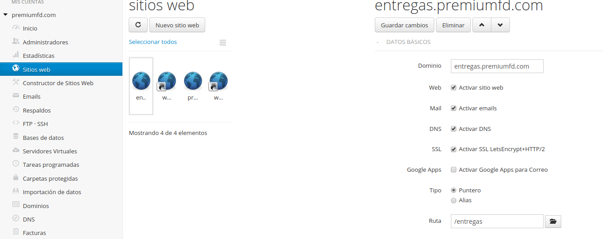

# Para desplegar la app en el server
En el server, subis la carpeta a la ubicacion deseada

Entras a la consola por SSH .. (tenes que tener un cliente ssh)
y te loggeas en elserver con tus credenciales
Un vez en la carpeta desdeada tecleas los siguiente commandos

```bash
export TMPDIR=/www/premiumfd.com.com/tmp; export HOME=/www/premiumfd.com.com/
```
```bash
/usr/local/bin/npm install
```


